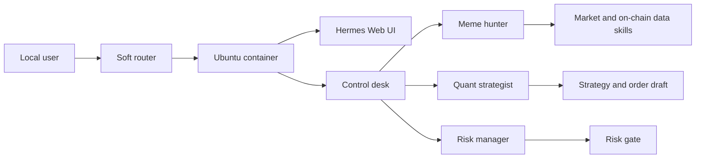

# Hermes Router Agent Lab

Self-hosted multi-agent deployment notes for running Hermes Agent on a home soft router.

This repository is a public, sanitized showcase of a real deployment. It documents the architecture, operations model, health checks, persona layout, watchdog design, and security boundaries. It does not contain private configuration, runtime databases, browser profiles, chat sessions, Telegram or WeChat state, API keys, proxy credentials, or trading credentials.

## What This Project Shows

- Hermes Agent running inside an Ubuntu container on a home soft router.
- A consolidated four-persona crypto research and trading workflow.
- Process supervision with an idempotent startup script plus a host-level watchdog.
- LAN-only Web UI and local API health checks.
- Separation between public deployment patterns and private runtime state.
- A repeatable inventory collection script that redacts sensitive fields.

## Current Runtime Snapshot

Observed from the live router deployment on 2026-06-26:

| Area | Value |
| --- | --- |
| Upstream project | `NousResearch/hermes-agent` |
| Runtime version | `Hermes Agent v0.9.0 (2026.4.13)` |
| Python | `3.11.15` |
| OpenAI SDK | `2.31.0` |
| Host shape | x86 soft router running an Ubuntu user-space container |
| Active personas | control desk, meme hunter, quant strategist, risk manager |
| Experimental profile | WeChat profile registered but not part of the default active set |
| Web UI | LAN-only, port `8670` in the private deployment |
| Local API ports | One local health endpoint per active persona |
| Storage model | Persistent config mounted outside the container |
| Watchdog | Host cron calls a container startup script every 5 minutes |

## Architecture



## Repository Layout

```text
docs/
  architecture.md              Architecture and persona responsibilities
  operations.md                Start, stop, health check, and recovery flow
  security.md                  Public release and secret handling policy
  live-scan-2026-06-26.md      Sanitized observations from the live deployment
deploy/
  env.example                  Placeholder environment variables
  profile.config.example.yaml  Redacted profile configuration template
  start_all_hermes.example.sh  Idempotent persona launcher
  router-watchdog.example.sh   Host-level watchdog pattern
scripts/
  collect-hermes-inventory.sh  Redacted inventory collector
```

## Quick Start

Clone the upstream Hermes Agent project separately:

```bash
git clone https://github.com/NousResearch/hermes-agent.git
```

Then adapt the examples in this repository:

```bash
cp deploy/env.example .env
cp deploy/profile.config.example.yaml config.yaml
bash deploy/start_all_hermes.example.sh --status
```

For a router deployment, copy the startup script into the persistent Hermes config directory inside the container and call it from a host watchdog. Keep secrets in local environment files or a secret manager, never in Git.

## Security Boundary

This repository is safe to publish because it intentionally excludes:

- `.env` and credential files.
- API keys, proxy authentication, Telegram bot tokens, WeChat tokens, cookies, and sessions.
- Browser profiles, chat stores, SQLite databases, WAL files, logs, and caches.
- Real LAN addresses, DDNS names, webhook URLs, and exchange credentials.
- Any private trading state or account balances.

See [docs/security.md](docs/security.md) for the full release policy.

## Upstream

Hermes Agent is developed upstream at [NousResearch/hermes-agent](https://github.com/NousResearch/hermes-agent). This repository documents a deployment overlay and operational pattern rather than republishing the upstream source tree.

