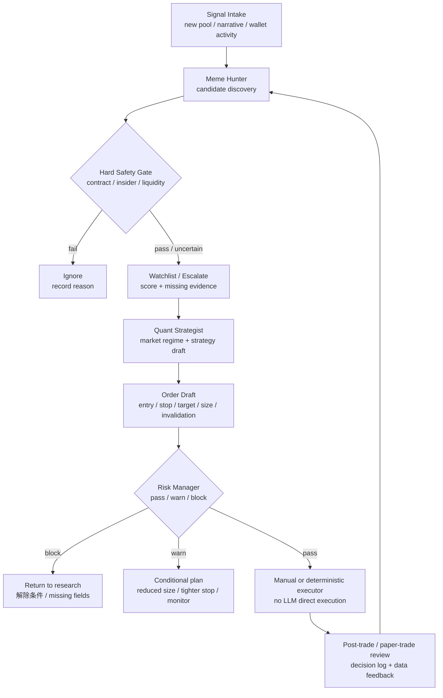
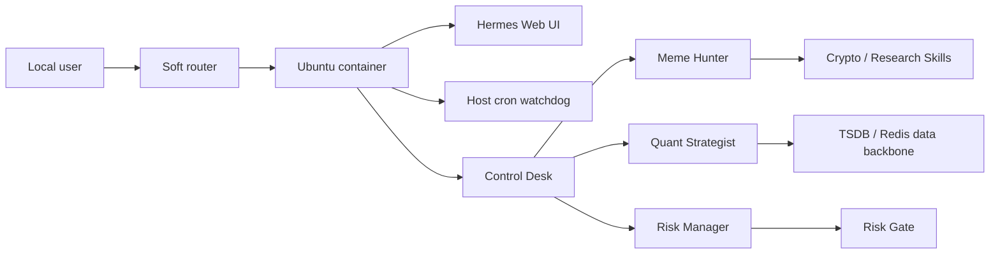

# Hermes Router Agent Lab

<div align="center">

[](#)
[](#)
[](#)

**一个运行在家庭软路由上的 Hermes 多智能体加密研究与交易决策实验室**

把候选发现、链上风险校验、策略生成、风控审批、Web UI、健康检查和自恢复 watchdog 收敛到一套可展示、可复用、可脱敏发布的部署样板里。

</div>

---

## 项目简介

`hermes-router-agent-lab` 是我把软路由上真实运行的 Hermes Agent 多智能体系统整理成的公开展示项目。

这个项目要解决的核心问题，不是“再部署一个聊天机器人”，而是：

- 如何在一台家庭软路由上长期运行多个独立 persona 的 agent 系统
- 如何把加密货币研究流程拆成候选发现、策略设计、风控闸门和人工确认
- 如何用 watchdog、PID 文件、健康检查和 LAN-only Web UI 保障系统可恢复
- 如何把真实部署经验公开展示，同时不泄露 API Key、Telegram / WeChat 会话、代理认证、内网入口和交易状态

本仓库是 **sanitized public showcase**。真实生产配置、`.env`、会话数据库、浏览器 profile、缓存和凭证不在仓库内。

---

## 部署时间线

| 日期 | 事件 |
| --- | --- |
| 2026-04-23 | 首次在软路由 Ubuntu 容器中建立 Hermes 运行档案，确认路径、容器归属、进程和 persona 清单 |
| 2026-04-24 | 完成第一轮全量多 agent 部署校准：8 个 dedicated crypto persona + 1 个 root gateway，补齐 Telegram 绑定、crypto skills、watchdog 和数据底座设计 |
| 2026-04-28 | 架构收敛：删除 6 个常驻 dedicated persona，把职责合并为 4 个 active persona，降低常驻复杂度 |
| 2026-04-29 | 新增 `hermes-wechat` profile，作为微信集成实验入口，默认不纳入自动启动 |
| 2026-05-02 | `start_all_hermes.sh` v2 加固：PID 文件检测、`flock` 防并发拉起、watchdog cron 从 1 分钟调整为 5 分钟 |
| 2026-06-09 | 引入 `cheat-on-content` 社交内容 skills，扩展社媒内容学习、评分、发布和复盘能力 |
| 2026-06-15 | 修复 Web UI / API 端口与历史房间残留问题，并切换默认模型到 `mimo-v2.5` |
| 2026-06-26 | 将部署经验整理为此公开 GitHub 展示项目 |

---

## 功能特性

- **软路由常驻部署** - Hermes 运行在 Ubuntu 容器中，配置目录持久化，适合 7x24 小型家庭实验室环境。
- **四角色多智能体协作** - control desk / meme hunter / quant strategist / risk manager 各自独立进程、独立 profile、独立职责边界。
- **加密研究工作流** - 覆盖候选发现、叙事判断、链上安全、smart-money 信号、策略草案、仓位与风控审批。
- **Watchdog 自恢复** - Docker restart policy + host cron + container startup script 双层保障。
- **并发保护** - 启动脚本使用 PID 文件和 `flock`，避免 watchdog race 导致重复 bot polling。
- **LAN-only 运维界面** - Web UI 和 local API health 默认只作为局域网运维入口。
- **技能体系可扩展** - crypto / research / social-media / devops / browser automation 等 skills 按 persona 分发。
- **公开仓库脱敏边界** - 只保留架构、流程、脚本模板和占位配置，不公开真实运行态数据。

---

## Agent 分工

当前稳定架构为 4 个 active persona + 1 个实验 profile：

| Agent | 状态 | 核心职责 | 不做什么 |
| --- | --- | --- | --- |
| Control Desk | Active | 总控入口、状态查询、任务路由、人工确认、运维协调 | 不替代专业 agent 做候选评级、策略生成或风险放行 |
| Meme Hunter | Active | 早期 meme 候选发现、叙事强度、社区热度、链上/合约初筛、smart-money 线索 | 不输出最终买入批准 |
| Quant Strategist | Active | 市场状态识别、策略选择、回测假设、仓位草案、订单字段草案 | 不声称已回测或已下单，除非有真实工具输出或外部回执 |
| Risk Manager | Active | 最终风控闸门、仓位上限、止损、杠杆、流动性、相关性和熔断判断 | 不在字段缺失时默认放行 |
| Hermes WeChat | Manual / Experimental | 微信入口、消息接入和后续多端触达实验 | 默认不在 watchdog active set 中自动启动 |

### 旧角色如何合并

早期部署里曾有 `market-intel`、`onchain-analyst`、`backtesting`、`trade-executor`、`data-pipeline` 等 dedicated persona。2026-04-28 后这些职责被合并：

- 市场情报、叙事和 KOL 线索并入 `Meme Hunter`
- 链上安全、持仓分布、合约风险并入 `Meme Hunter`
- 回测摘要、策略匹配、订单草案并入 `Quant Strategist`
- 最终审批、仓位闸门和熔断判断保留给 `Risk Manager`
- 真正下单必须交给 deterministic executor、人工确认或外部回执，LLM 不直接执行实盘交易

---

## Skills 矩阵

Hermes 的 skills 按全局能力和 persona 专属能力分发。下表只列公开可展示的能力类别，不包含任何密钥、账号、token 或私有会话。

| Skill 组 | 主要能力 | 主要使用方 |
| --- | --- | --- |
| `crypto-dexscreener` | DEX 行情、新池子、boosted token、候选初筛 | Meme Hunter |
| `crypto-birdeye` | 价格、持仓、钱包和市场数据补充 | Meme Hunter / Quant Strategist |
| `crypto-goplus` | 合约安全、honeypot、税率、proxy、权限风险 | Meme Hunter / Quant Strategist |
| `crypto-smart-money` | 聪明钱钱包、买入共识、钱包评分 | Meme Hunter / Quant Strategist |
| `crypto-insider-detect` | 老鼠仓、block-0 sniper、同资金源、dev 关联风险 | Meme Hunter / Risk Manager |
| `crypto-data-store` | TimescaleDB / Redis 数据底座，保存行情、事件、决策和 skill 调用 | All active crypto personas |
| `crypto-fear-greed` / `crypto-coingecko` | 全局情绪与基础市场数据 fallback | Meme Hunter |
| `ethereum-meme-quick-screen` | Ethereum meme 候选快速筛查 | Meme Hunter |
| `geckoterminal-new-pools-scan` | 新池子扫描与候选补充 | Meme Hunter |
| `solana-wallet-pnl-reconstruction` | Solana 钱包 PnL 重建 | Meme Hunter / Quant Strategist |
| `solana-meme-risk-crosscheck` | Solana meme 风险交叉验证 | Meme Hunter / Risk Manager |
| `binance-*` / `btc-intraday-*` | Binance 持仓检查、BTC 日内订单计划、仓位监控 | Quant Strategist |
| `smc-*` | SMC 市场状态、订单检查、交易计划、退出管理和复盘纪律 | Quant Strategist |
| `cheat-on-content` / `cheat-*` | 社交内容学习、预测、评分、发布和复盘 | Global / active personas |
| `github-*` / `software-development-*` | 代码库检查、PR 工作流、系统调试、测试驱动开发 | Control Desk / engineering tasks |
| `browser-automation` / `research` | 浏览器自动化、资料抓取、研究整理 | Control Desk / specialist tasks |

---

## 业务流程



### 流程说明

1. **信号进入**：候选可能来自新池子扫描、叙事轮动、钱包活动、社媒内容或人工输入。
2. **候选筛查**：`Meme Hunter` 给出 `ignore` / `watchlist` / `escalate`，并说明证据、缺失字段和失效条件。
3. **硬安全门**：合约风险、老鼠仓风险、流动性、持仓集中度和数据新鲜度优先于叙事热度。
4. **策略草案**：`Quant Strategist` 只生成策略与订单草案，明确市场状态、入场、止损、目标和仓位假设。
5. **风控审批**：`Risk Manager` 负责最终 `pass` / `warn` / `block`，缺字段时默认保守。
6. **执行边界**：LLM 不直接实盘下单。通过后仍需要人工确认、确定性执行器或外部成交回执。
7. **复盘回流**：纸面交易、模拟执行或真实回执进入数据底座，用于下一轮参数、风险和候选质量复盘。

---

## 架构概览



---

## 技术栈

| 模块 | 技术 / 形式 |
| --- | --- |
| Agent runtime | Hermes Agent v0.9.0 |
| 语言 / 运行时 | Python 3.11 |
| 容器环境 | Ubuntu container on x86 soft router |
| 进程管理 | Bash startup script + PID files + `flock` |
| 自恢复 | Docker restart policy + host cron watchdog |
| UI / API | Hermes Web UI + local health endpoints |
| 模型接入 | OpenAI-compatible custom provider |
| 数据底座 | TimescaleDB + Redis pattern |
| 配置发布 | `.env.example` + redacted config template |
| 安全边界 | secret-free public docs + redacted inventory script |

---

## 当前运行快照

Observed from the live router deployment on 2026-06-26:

| Area | Value |
| --- | --- |
| Upstream project | `NousResearch/hermes-agent` |
| Runtime version | `Hermes Agent v0.9.0 (2026.4.13)` |
| Python | `3.11.15` |
| OpenAI SDK | `2.31.0` |
| Active personas | control desk, meme hunter, quant strategist, risk manager |
| Experimental profile | WeChat profile registered but not part of the default active set |
| Web UI | LAN-only Web UI pattern, private port documented as an example |
| Local API | One local health endpoint per active persona |
| Storage model | Persistent config mounted outside the container |
| Watchdog | Host cron calls an idempotent container startup script every 5 minutes |

---

## 目录结构

```bash
hermes-router-agent-lab/
├── README.md
├── docs/
│   ├── architecture.md
│   ├── operations.md
│   ├── security.md
│   └── live-scan-2026-06-26.md
├── deploy/
│   ├── env.example
│   ├── profile.config.example.yaml
│   ├── start_all_hermes.example.sh
│   └── router-watchdog.example.sh
└── scripts/
    └── collect-hermes-inventory.sh
```

---

## 快速开始

### 1）克隆上游 Hermes Agent

```bash
git clone https://github.com/NousResearch/hermes-agent.git
```

### 2）复制本仓库的脱敏配置模板

```bash
cp deploy/env.example .env
cp deploy/profile.config.example.yaml config.yaml
```

### 3）查看 persona 状态

```bash
bash deploy/start_all_hermes.example.sh --status
```

### 4）采集脱敏 inventory

```bash
ROUTER_ALIAS=router HERMES_CONTAINER=ubuntu2 bash scripts/collect-hermes-inventory.sh
```

---

## 当前已实现内容

### 已完成

- [x] 读取并整理软路由 Hermes 的真实部署信息
- [x] 形成可公开的 README、架构文档、运维文档和安全说明
- [x] 提供脱敏 `env.example` 与 `profile.config.example.yaml`
- [x] 提供 idempotent startup script 示例
- [x] 提供 host watchdog 示例
- [x] 提供脱敏 inventory 采集脚本
- [x] 高置信 secret pattern 扫描无命中

### 可展示能力

- 软路由上长期运行多 persona agent 系统的工程经验
- 多 agent 职责边界、风控闸门和业务流程拆分
- 把真实私有系统整理成公开 GitHub portfolio 项目的脱敏能力
- 将运维脚本、配置模板、安全边界和系统说明放到同一个可复用仓库

---

## 安全边界

这个仓库不会包含：

- `.env` 和真实 credential 文件
- API keys、代理认证、Telegram bot token、WeChat token、cookie 和 session
- 浏览器 profile、聊天库、SQLite 数据库、WAL 文件、日志和缓存
- 真实 DDNS、webhook、内网入口、交易账号状态或仓位信息
- 任何实盘交易密钥或可直接执行交易的配置

更多规则见 [docs/security.md](docs/security.md)。

---

## 路线图

- [ ] 给 `docs/architecture.md` 增加更完整的 persona-to-skill 映射
- [ ] 增加一个脱敏版 Grafana / Uptime Kuma 监控截图或示意图
- [ ] 把 startup script 和 watchdog 拆成更通用的 router deployment template
- [ ] 增加 paper-trading / deterministic executor 的公开接口设计说明
- [ ] 用 GitHub Actions 加一条 README secret-scan / shellcheck 验证

---

## 项目方向

这个项目不是交易建议，也不是完整开源交易系统。

它更像一个 **个人 AI 工程能力展示项目**，重点表达：

- 能把 LLM agent 长期部署到资源受限但稳定在线的家庭软路由环境
- 能把复杂业务拆成多 agent 协作流程，而不是把所有能力塞进一个大 prompt
- 能把候选发现、策略生成、风险控制和执行边界拆清楚
- 能把私有部署经验安全整理成 public GitHub 项目
- 能把运维、文档、脚本、脱敏和验证作为同一个工程闭环处理

---

## Upstream

Hermes Agent is developed upstream at [NousResearch/hermes-agent](https://github.com/NousResearch/hermes-agent). This repository documents a deployment overlay and operational pattern rather than republishing the upstream source tree.

---

<div align="center">

Built for self-hosted agent operations, crypto research workflows, and secret-safe public sharing.

</div>

